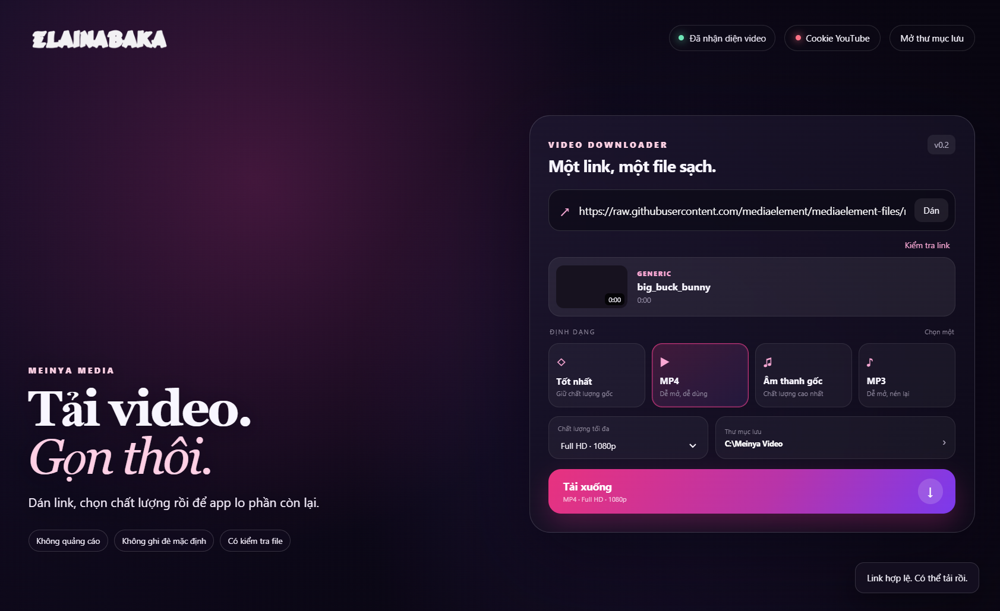
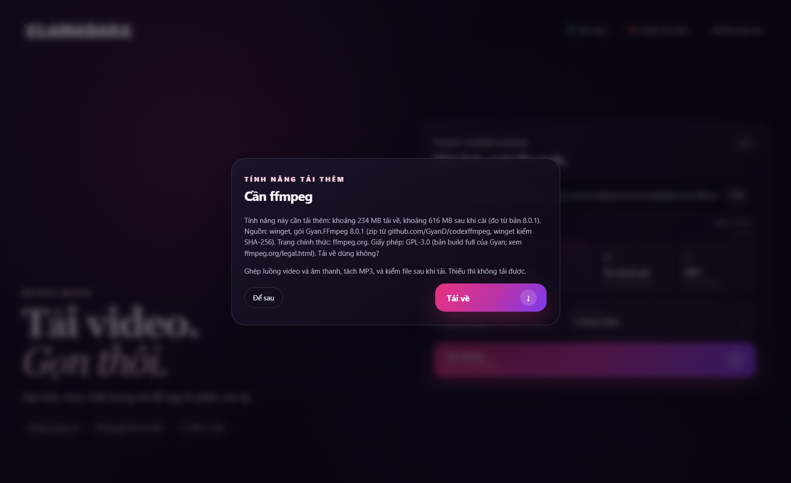

# Meinya Video Downloader

App desktop cho Windows: dán link, chọn chất lượng rồi tải video hoặc âm thanh bằng [yt-dlp](https://github.com/yt-dlp/yt-dlp). Sau khi tải, `ffprobe` kiểm tra file; chỉ báo thành công khi file đọc được.



> **Chỉ tải nội dung bạn có quyền, và tuân điều khoản của nền tảng.**

## Bắt đầu nhanh

1. Tải repo về (nút **Code → Download ZIP**) rồi giải nén vào một thư mục.
2. Bấm đúp **`run.bat`**. Lần đầu máy tự tạo `.venv` và cài yt-dlp, pywebview đúng bản đã ghim (cần Python 3.10 trở lên từ python.org, nhớ tick *Add python.exe to PATH*).
3. Dán link, bấm **Kiểm tra link**, chọn định dạng rồi bấm **Tải xuống**. Nếu máy chưa có ffmpeg, app hỏi trước khi tải về.

Chạy lại sau này chỉ cần bấm `run.bat`.

## Tính năng

| Tính năng | Có sẵn | Tải khi cần (khi bạn bấm bật) |
|---|---|---|
| Giao diện, dán link, kiểm tra link, chọn chất lượng tối đa, chọn thư mục lưu, hủy lượt tải | ✅ | |
| Cookie YouTube (tùy chọn, lưu trên máy bạn, không hiện lại giá trị) | ✅ | |
| Tải MP4, tải âm thanh gốc, xuất MP3, ghép luồng video và âm thanh, kiểm file sau khi tải | | ffmpeg và ffprobe: khoảng 234 MB tải về, khoảng 616 MB trên đĩa sau khi cài (bản 8.0.1) |

### Hộp thoại "Tải về"

Khi máy chưa có ffmpeg và bạn bấm **Tải xuống**, app hiện hộp thoại: cần tải gì, khoảng bao nhiêu, từ đâu, giấy phép gì. Bạn chọn **Tải về** hoặc **Để sau**.

- ffmpeg được cài bằng **winget**, đúng bản **8.0.1** đã ghim. Winget tải gói chính thức từ Gyan (github.com/GyanD/codexffmpeg) và kiểm SHA-256 theo manifest của winget.
- Cài xong app tự tiếp tục lượt tải. Cài lỗi thì báo lý do, tính năng vẫn tắt, app vẫn chạy bình thường.
- Cài vào máy bạn qua winget, không đụng Python hệ thống.



## Yêu cầu

- Windows 10 hoặc 11.
- Python 3.10 trở lên.
- winget để app cài ffmpeg (thường có sẵn trên Windows 10 và 11). Không có winget thì tải ffmpeg 8.0.1 từ [ffmpeg.org](https://ffmpeg.org/download.html), thêm vào `PATH`, rồi mở lại app.

## Dòng lệnh

Sau khi `run.bat` đã tạo `.venv`, và ffmpeg đã có:

```bat
.venv\Scripts\python.exe -m video_downloader.cli inspect "https://example.com/video"
.venv\Scripts\python.exe -m video_downloader.cli preview "https://example.com/video" --output ".\xem"
.venv\Scripts\python.exe -m video_downloader.cli download "https://example.com/video" --output ".\downloads" --profile mp4-compatible --quality 1080
```

`inspect` chỉ đọc thông tin. `preview` chỉ lưu ảnh khung hình và thông tin quyền dùng, không tải media.

## Cookie YouTube (tùy chọn)

Chỉ dùng cookie của chính tài khoản YouTube của bạn. Có thể đưa cookie dạng Netscape vào app (nút **Cookie YouTube**) hoặc đặt file vào thư mục `cookie/`. Cookie chỉ lưu trên máy bạn, giao diện không bao giờ hiển thị lại giá trị cookie, và thư mục `cookie/` đã nằm trong `.gitignore`. Không chia sẻ file cookie.

## Giới hạn

- Chỉ tải một video mỗi lần. Playlist và DRM chưa được hỗ trợ.
- Không có cơ chế riêng cho các nền tảng ngoài YouTube và các nguồn yt-dlp hỗ trợ.
- Nhiều nền tảng thay đổi cách phát liên tục. Khi tải lỗi, thử cập nhật phiên bản `yt-dlp` (đang ghim trong `requirements.txt`).

## Test

```bat
.venv\Scripts\python.exe -X utf8 -m unittest discover -s tests -v
```

Test mạng (tải một video mẫu thật, cần ffmpeg) chỉ chạy khi đặt biến `MEINYA_RUN_NETWORK_TEST=1`:

```bat
set MEINYA_RUN_NETWORK_TEST=1
.venv\Scripts\python.exe -X utf8 -m unittest tests.test_smoke -v
```

## Giấy phép

- Mã của repo: MIT, xem [LICENSE](LICENSE).
- Thư viện cài sẵn khi chạy `run.bat`:

| Thư viện | Phiên bản | Giấy phép |
|---|---|---|
| yt-dlp | 2026.8.19 | The Unlicense |
| pywebview | 6.2.1 | BSD-3-Clause |
| requests | 2.34.2 (kéo theo yt-dlp) | Apache-2.0 |
| certifi | 2026.7.22 (kéo theo yt-dlp) | MPL-2.0 |
| urllib3 | 2.8.0 (kéo theo yt-dlp) | MIT |
| websockets | 17.2 (kéo theo yt-dlp) | BSD-3-Clause |
| brotli | 1.2.0 (kéo theo yt-dlp) | MIT |
| pycryptodomex | 3.24.0 (kéo theo yt-dlp) | BSD hoặc Public Domain |
| mutagen | 1.48.1 (kéo theo yt-dlp) | **GPL-2.0-or-later** |

- Thư viện và mã tải khi bạn bật tính năng: ffmpeg 8.0.1 (gói Gyan), giấy phép GPL-3.0 theo bản build. Xem [ffmpeg.org/legal.html](https://ffmpeg.org/legal.html).
- `mutagen` (đi kèm `yt-dlp[default]`) là GPL-2.0-or-later. Repo này không đóng gói nó; nó được cài cùng `yt-dlp` khi bạn chạy `run.bat`.
- Logo và tên **ElainaBaka** là của chủ sở hữu, **không thuộc giấy phép MIT** của repo. Không dùng lại logo hay tên này khi chưa có phép.

---

## English

Windows desktop app that downloads a video or extracts its audio with `yt-dlp`. After each download, `ffprobe` checks the final file and only then reports success.


> **Only download content you have the right to download, and follow the platform's terms.**

- **Quick start:** download the ZIP, double-click `run.bat` (first run creates `.venv` and installs the pinned `yt-dlp` and `pywebview`; Python 3.10+ needed), paste a link, and download.
- **Downloaded only when you turn it on:** ffmpeg 8.0.1 (about 234 MB download, about 616 MB installed). The app asks first, shows size, source and license, and installs it with winget (pinned version, SHA-256 checked by winget).
- **Requirements:** Windows 10 or 11, Python 3.10+, winget (or install ffmpeg 8.0.1 yourself and add it to `PATH`).
- **Tests:** `.venv\Scripts\python.exe -X utf8 -m unittest discover -s tests -v`.
- **Code license:** MIT. `mutagen` (pulled in by `yt-dlp[default]`) is GPL-2.0-or-later. The logo and the name ElainaBaka are not covered by the MIT license.
